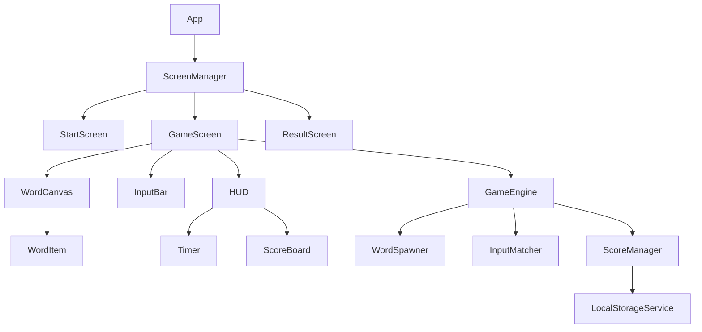
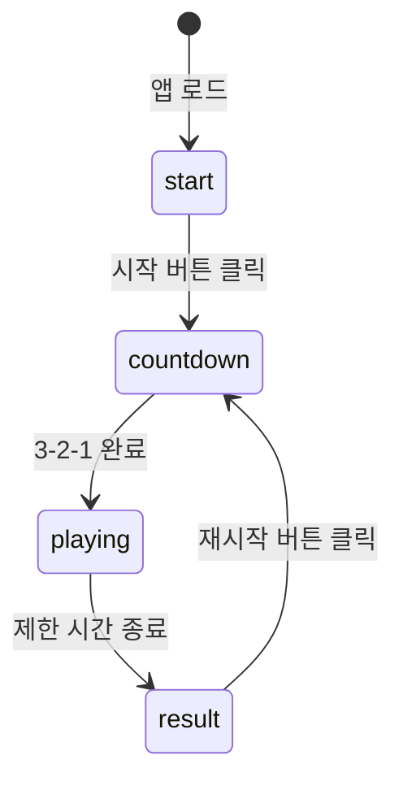
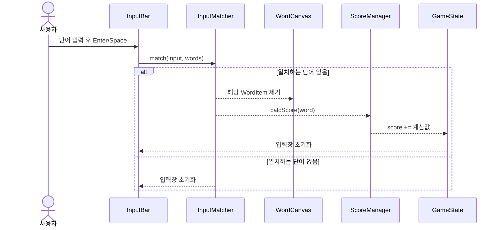
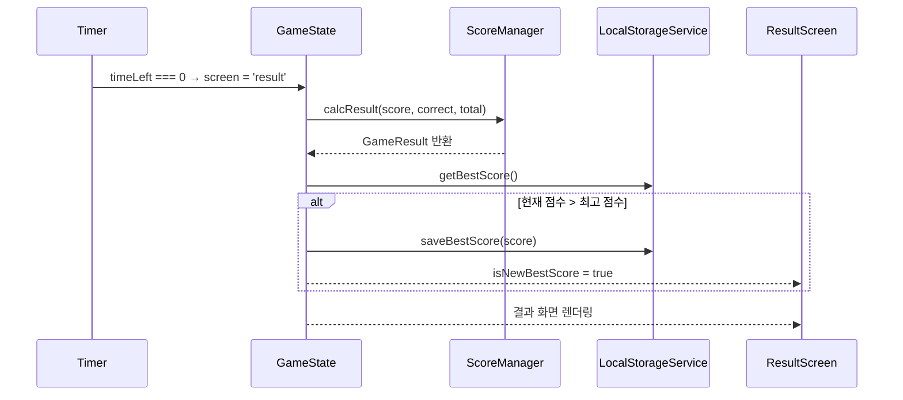

# Tech Spec: 워드 매치 게임

---

## 1. 문서 정보

| 항목 | 내용 |
|------|------|
| **작성일** | 2026-03-14 |
| **상태** | Draft |
| **버전** | v0.1 |
| **원문 PRD** | wordmatchgame-prd.md |

---

## 2. 시스템 아키텍처

### 2-1. 아키텍처 패턴

| 패턴 | 선택 이유 |
|------|-----------|
| 순수 프론트엔드 SPA | 백엔드 서버 불필요. 최고 점수는 localStorage에 저장. GitHub Pages로 즉시 배포 가능. 교육용 프로젝트에 구조가 명확하고 단순함. |

### 2-2. 컴포넌트 구성도



### 2-3. 배포 환경

| 환경 | 호스팅 | 비고 |
|------|--------|------|
| Frontend | GitHub Pages | 정적 파일 배포 |
| Backend | 없음 | 불필요 |
| Database | 없음 | localStorage 사용 |
| CI/CD | GitHub Actions | 빌드 & 자동 배포 |

---

## 3. 기술 스택

| 분류 | 기술 | 버전 | 선정 이유 |
|------|------|------|-----------|
| UI 프레임워크 | React | 18.x | 컴포넌트 기반 구조로 화면(시작/게임/결과) 분리가 명확. 상태 관리가 직관적. |
| 언어 | TypeScript | 5.x | 게임 상태·단어 객체 타입을 명시하여 런타임 오류 방지. |
| 스타일 | CSS Modules | — | 컴포넌트 단위 스코프 스타일. 외부 라이브러리 없이 구조 파악이 쉬움. |
| 빌드 도구 | Vite | 5.x | 빠른 개발 서버와 간단한 설정. CRA 대비 경량. |
| 데이터 저장 | localStorage | Web API | 서버 없이 최고 점수 영속 저장. 브라우저 내장 API로 의존성 없음. |
| 패키지 매니저 | npm | 10.x | 별도 설정 없이 바로 사용 가능. |
| 테스트 | Vitest + React Testing Library | 최신 | Vite 환경과 통합이 자연스러움. 컴포넌트 단위 테스트에 적합. |
| 배포 | GitHub Pages | — | 정적 SPA 배포에 최적. GitHub Actions로 자동화 가능. |

---

## 4. 데이터 모델

### 4-1. TypeScript 인터페이스

```typescript
// 화면에 표시되는 단어 하나
interface WordItem {
  id: string;          // 고유 식별자 (uuid)
  text: string;        // 단어 텍스트
  x: number;           // 화면 X 좌표 (%)
  y: number;           // 화면 Y 좌표 (%)
  createdAt: number;   // 생성 타임스탬프 (ms)
  lifespan: number;    // 화면에 머무는 시간 (ms)
}

// 게임 전체 상태
interface GameState {
  screen: 'start' | 'countdown' | 'playing' | 'result';
  words: WordItem[];        // 현재 화면에 있는 단어 목록
  score: number;            // 현재 점수
  timeLeft: number;         // 남은 시간 (초)
  lastWord: string | null;  // 직전 출현 단어 (중복 방지)
  inputValue: string;       // 입력창 현재 값
  isNewBestScore: boolean;  // 최고 점수 갱신 여부
}

// 게임 설정
interface GameConfig {
  timeLimitSec: number;   // 제한 시간 (30~120, 기본 60)
  maxWords: number;       // 최대 동시 표시 단어 수 (기본 5)
}

// 결과 화면 요약 (P1 유저 스토리 대응)
interface GameResult {
  score: number;
  correctCount: number;   // 맞힌 단어 수
  totalCount: number;     // 도전한 단어 수
  accuracy: number;       // 정확도 (%)
}

// localStorage 저장 구조
interface LocalStorageSchema {
  bestScore: number;      // 최고 점수
}
```

### 4-2. 상태 흐름 다이어그램



### 4-3. localStorage 스키마

| 키 | 타입 | 기본값 | 설명 |
|----|------|--------|------|
| `wm_best_score` | number | 0 | 역대 최고 점수 |

---

## 5. API 명세

> 백엔드가 없는 순수 프론트엔드 앱이므로, 외부 REST API 대신 **내부 서비스 모듈 인터페이스**를 정의한다.

### 5-1. LocalStorageService

```typescript
const LocalStorageService = {
  // 최고 점수 불러오기 (없으면 0 반환)
  getBestScore(): number,

  // 최고 점수 저장 (현재값보다 높을 때만 갱신)
  saveBestScore(score: number): void,
}
```

### 5-2. WordSpawner

```typescript
const WordSpawner = {
  // 랜덤 단어 1개 생성 (직전 단어 제외)
  spawn(lastWord: string | null): WordItem,

  // 수명이 다한 단어 목록에서 제거
  removeExpired(words: WordItem[]): WordItem[],
}
```

### 5-3. InputMatcher

```typescript
const InputMatcher = {
  // 입력값과 일치하는 단어 찾기 (없으면 null)
  match(input: string, words: WordItem[]): WordItem | null,
}
```

### 5-4. ScoreManager

```typescript
const ScoreManager = {
  // 단어 맞힘 시 점수 계산 (단어 길이 기반)
  calcScore(word: WordItem): number,

  // 게임 결과 요약 생성
  calcResult(score: number, correct: number, total: number): GameResult,
}
```

### 5-5. 점수 계산 규칙

| 조건 | 점수 |
|------|------|
| 단어 길이 1~3자 | +1점 |
| 단어 길이 4~6자 | +2점 |
| 단어 길이 7자 이상 | +3점 |

---

## 6. 상세 기능 명세

### 6-1. 컴포넌트 트리

```
App
├── ScreenManager          # screen 상태에 따라 화면 전환
│   ├── StartScreen        # 시작 화면 (최고 점수 표시 + 시작 버튼)
│   ├── CountdownOverlay   # 3-2-1 카운트다운 오버레이
│   ├── GameScreen         # 게임 진행 화면
│   │   ├── HUD            # 상단 정보 바
│   │   │   ├── Timer      # 남은 시간 표시
│   │   │   └── ScoreBoard # 현재 점수 표시
│   │   ├── WordCanvas     # 단어 애니메이션 영역
│   │   │   └── WordItem   # 개별 단어 카드 (위치/애니메이션 포함)
│   │   └── InputBar       # 하단 입력창
│   └── ResultScreen       # 결과 화면 (점수, 정확도, 재시작 버튼)
└── Spinner                # 전역 로딩 스피너
```

### 6-2. 핵심 로직 시퀀스 — 단어 입력 & 점수 계산



### 6-3. 핵심 로직 시퀀스 — 게임 종료 & 최고 점수 갱신



### 6-4. 상태 관리 방식

| 상태 | 관리 위치 | 비고 |
|------|-----------|------|
| `GameState` | `useReducer` (App 레벨) | 게임 전체 상태 단일 관리 |
| `GameConfig` | `useState` (App 레벨) | 시작 전 설정값 |
| `inputValue` | `useState` (InputBar) | 로컬 상태로 분리 |
| `bestScore` | `LocalStorageService` | 앱 로드 시 1회 읽기 |

### 6-5. 엣지 케이스 처리

| 상황 | 처리 방식 |
|------|-----------|
| 단어가 0개일 때 입력 | InputMatcher가 null 반환 → 입력창만 초기화 |
| 카운트다운 중 입력 시도 | InputBar `disabled` 속성으로 비활성화 |
| 타이머 종료 시 입력 중 | GameState가 즉시 `result` 전환, 입력값 무효 처리 |
| 단어가 화면 밖으로 나감 | `WordSpawner.removeExpired()` 호출 시 자동 제거 |

---

## 7. UI/UX 스타일 가이드

### 7-1. 디자인 토큰 (CSS Custom Properties)

```css
:root {
  /* 색상 */
  --color-bg:        #0f172a;   /* 배경 (딥 네이비) */
  --color-surface:   #1e293b;   /* 카드/입력창 배경 */
  --color-primary:   #38bdf8;   /* 주요 액션 (스카이 블루) */
  --color-success:   #4ade80;   /* 단어 맞힘 피드백 */
  --color-danger:    #f87171;   /* 오류/경고 */
  --color-text:      #f1f5f9;   /* 기본 텍스트 */
  --color-muted:     #94a3b8;   /* 보조 텍스트 */

  /* 타이포그래피 */
  --font-family:     'Inter', sans-serif;
  --font-size-sm:    0.875rem;  /* 14px */
  --font-size-md:    1rem;      /* 16px */
  --font-size-lg:    1.5rem;    /* 24px */
  --font-size-xl:    2.25rem;   /* 36px */

  /* 간격 */
  --spacing-xs:  4px;
  --spacing-sm:  8px;
  --spacing-md:  16px;
  --spacing-lg:  32px;

  /* 모서리 */
  --radius-sm:   6px;
  --radius-md:   12px;

  /* 트랜지션 */
  --transition:  0.15s ease;
}
```

### 7-2. 공통 컴포넌트 사양

| 컴포넌트 | 사양 |
|----------|------|
| **Button (Primary)** | 배경 `--color-primary`, 텍스트 `#0f172a`, radius `--radius-md`, padding `12px 32px` |
| **InputBar** | 배경 `--color-surface`, 테두리 `--color-primary`, 포커스 시 glow 효과, 전체 너비 |
| **WordItem** | 배경 `--color-surface`, 텍스트 `--color-primary`, radius `--radius-sm`, 위→아래 CSS 애니메이션 |
| **HUD** | 상단 고정 바, 좌측 타이머 / 우측 점수, 배경 반투명 |
| **Spinner** | 중앙 정렬, `--color-primary` 색상, 1초 회전 루프 |

### 7-3. 화면 레이아웃

```
┌──────────────────────────────┐
│  ⏱ 00:45        점수: 12    │  ← HUD (상단 고정)
├──────────────────────────────┤
│                              │
│   [apple]    [keyboard]      │  ← WordCanvas (단어 낙하 영역)
│         [mouse]              │
│                              │
│                              │
├──────────────────────────────┤
│  [ 여기에 입력하세요...  ]   │  ← InputBar (하단 고정)
└──────────────────────────────┘
```

### 7-4. 애니메이션 규칙

| 대상 | 애니메이션 |
|------|-----------|
| 단어 등장 | `fadeInDown` 0.3s ease |
| 단어 맞힘 | `flash` (초록 glow) 0.2s → 사라짐 |
| 단어 시간 초과 | `fadeOut` 0.3s ease |
| 최고 점수 갱신 | `bounceIn` 텍스트 + 골드 색상 강조 |
| 카운트다운 숫자 | `scaleDown` 1s per count |

### 7-5. 접근성

| 항목 | 기준 |
|------|------|
| 색상 대비 | WCAG AA 준수 (4.5:1 이상) |
| 키보드 | 마우스 없이 Tab + Enter로 모든 조작 가능 |
| 포커스 | InputBar 자동 포커스 (게임 시작 시) |

---

## 8. 개발 마일스톤

> AI(Claude Code 등) 기반 개발을 가정한 예상 소요 시간입니다.

### Phase 1 — 기반 구축 (예상: 10분)

| # | 작업 | 산출물 |
|---|------|--------|
| 1 | Vite + React + TypeScript 프로젝트 초기화 | 프로젝트 골격 |
| 2 | CSS 디자인 토큰 설정 | `variables.css` |
| 3 | GitHub Actions CI/CD 파이프라인 구성 | `.github/workflows/deploy.yml` |
| 4 | GitHub Pages 배포 환경 연결 | 배포 URL 확인 |

### Phase 2 — 핵심 기능 구현 (예상: 30분)

| # | 작업 | 산출물 |
|---|------|--------|
| 1 | GameState 설계 및 `useReducer` 구현 | `useGameReducer.ts` |
| 2 | WordSpawner 서비스 구현 (랜덤 생성, 중복 방지) | `wordSpawner.ts` |
| 3 | WordCanvas + WordItem 컴포넌트 (낙하 애니메이션) | `WordCanvas.tsx` |
| 4 | InputBar 컴포넌트 + InputMatcher 서비스 | `InputBar.tsx`, `inputMatcher.ts` |
| 5 | ScoreManager 서비스 (점수 계산, 결과 산출) | `scoreManager.ts` |
| 6 | Timer 컴포넌트 (카운트다운, 게임 종료 트리거) | `Timer.tsx` |

### Phase 3 — 보조 기능 및 UI 완성 (예상: 20분)

| # | 작업 | 산출물 |
|---|------|--------|
| 1 | StartScreen 구현 (최고 점수 표시, 시작 버튼) | `StartScreen.tsx` |
| 2 | CountdownOverlay 구현 (3-2-1 애니메이션) | `CountdownOverlay.tsx` |
| 3 | ResultScreen 구현 (점수, 정확도, 재시작) | `ResultScreen.tsx` |
| 4 | LocalStorageService 구현 (최고 점수 저장/불러오기) | `localStorageService.ts` |
| 5 | 최고 점수 갱신 축하 애니메이션 | `ResultScreen.tsx` 업데이트 |

### Phase 4 — 안정화 및 배포 (예상: 10분)

| # | 작업 | 산출물 |
|---|------|--------|
| 1 | 단위 테스트 작성 (InputMatcher, ScoreManager, WordSpawner) | `*.test.ts` |
| 2 | 크로스 브라우저 검증 (Chrome, Safari) | 테스트 결과 |
| 3 | 접근성 검증 (키보드 조작, 색상 대비) | 체크리스트 |
| 4 | 최종 빌드 & GitHub Pages 배포 | 배포 URL |

**총 예상 개발 시간**: 약 70분 (사람 기준 7일 → AI 기준 약 1시간 10분)

---

## 부록

### A. 용어 정의

| 용어 | 정의 |
|------|------|
| WordItem | 화면에 표시되는 단어 하나의 데이터 객체 (위치, 텍스트, 수명 포함) |
| WordCanvas | 단어들이 낙하하는 게임 영역 컴포넌트 |
| HUD | 게임 중 상단에 표시되는 점수/타이머 정보 바 |
| lifespan | 단어가 화면에 머무는 시간 (ms). 이 시간이 지나면 자동 제거됨 |
| InputMatcher | 사용자 입력값과 현재 화면 단어 목록을 비교하는 서비스 |
| Best Score | localStorage에 영속 저장되는 역대 최고 점수 |
| Screen | 앱의 현재 화면 상태 (start / countdown / playing / result) |

### B. 미결 사항 (Open Questions)

| # | 질문 | 영향 범위 |
|---|------|-----------|
| 1 | 단어 목록의 출처는? (내장 하드코딩 vs 외부 JSON 파일 로드) | WordSpawner 구현 방식 |
| 2 | 단어가 화면에 머무는 lifespan은 고정값인가, 난이도에 따라 가변인가? | WordSpawner, GameConfig |
| 3 | 점수 계산 시 단어 길이 외에 남은 시간 보너스를 줄 것인가? | ScoreManager |
| 4 | 모바일 화면(터치 키보드)도 향후 지원할 것인가? | UI 레이아웃 반응형 설계 |

### C. 변경 이력

| 버전 | 날짜 | 내용 |
|------|------|------|
| v0.1 | 2026-03-14 | 최초 작성 |
